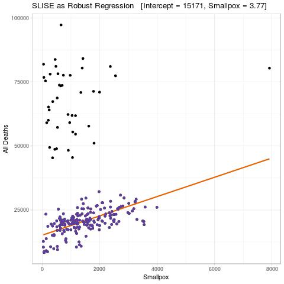
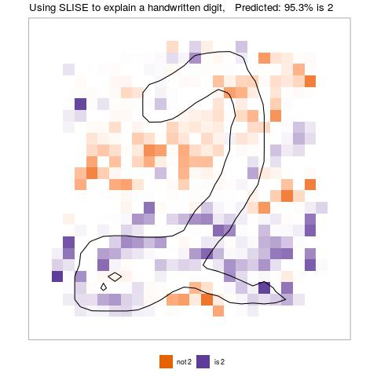

# SLISE - Sparse Linear Subset Explanations

R implementation of the SLISE algorithm. The SLISE algorithm can be used for
both robust regression and to explain outcomes from black box models.
For more details see [the paper](https://rdcu.be/bVbda), alternatively for a more informal
overview see [the presentation](vignettes/presentation.pdf), or [the poster](vignettes/poster.pdf).

> **Björklund A., Henelius A., Oikarinen E., Kallonen K., Puolamäki K.**  
> *Sparse Robust Regression for Explaining Classifiers.*  
> Discovery Science (DS 2019).  
> Lecture Notes in Computer Science, vol 11828, Springer.  
> https://doi.org/10.1007/978-3-030-33778-0_27


## Other Languages

The official Python version can be found [here](https://github.com/edahelsinki/pyslise).


## Installation
To install this R-package, proceed as follows.

First install the `devtools`-package and load it in R:
```R
install.packages("devtools")
library(devtools)
```

Then install the `slise` package

```R
install_github("edahelsinki/slise")
```

### Loading
After installation, start R and load the package using
```R
library(slise)
```


## Example

In order to use SLISE you need to have your data in a numerical matrix (or
something that can be cast to a matrix), and the response as a numerical vector.
Below is an example of SLISE being used for robust regression:

```R
source("experiments/utils.R")
data <- data_pox("fpox", "all")
slise <- slise.fit(X=data$X, Y=data$Y, epsilon=0.1, lambda=0)
title <- sprintf("SLISE as Robust Regression   [Intercept = %.0f, Smallpox = %.2f]",
    slise$coefficients[1], slise$coefficients[2])
plot(slise, labels=c("Smallpox", "All Deaths"), title=title)
```



SLISE can also be used to explain an opaque classifiers:

```R
source("experiments/utils.R")
set.seed(42)
emnist <- data_emnist(10000, classifier="digits2")
slise <- slise.explain(emnist$X, emnist$Y, 3, epsilon = 0.1, lambda = 2, logit = TRUE)
explain(slise, "image", class_labels=c("not 2", "is 2"), title="Using SLISE to explain a handwritten digit")
```



## Dependencies

SLISE depends on the following R-packages:

 - Rcpp
 - lbfgs
 - ggplot2

The following R-packages are optional, but needed for *some* of the built-in visualisations:

 - grid
 - gridExtra
 - reshape2
 - scatterplot3d
 - crayon
 - wordcloud
