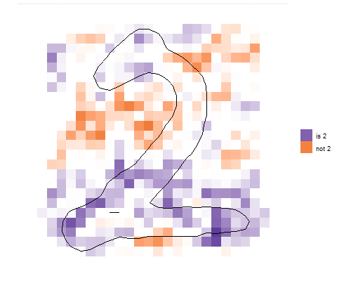

# SLISE - Sparse Linear Subset Explanations

[](https://edahelsinki.github.io/slise)
[](https://edahelsinki.github.io/slise)
[](https://github.com/edahelsinki/slise/actions/workflows/r_check.yml)
[](https://github.com/edahelsinki/slise/blob/master/LICENSE)

R implementation of the SLISE algorithm. The SLISE algorithm can be used for both robust regression and to explain outcomes from black box models. 
For more details see the [conference paper](https://rdcu.be/bVbda), the [robust regression paper](https://rdcu.be/cFRHD) or the [local explanations paper](https://doi.org/10.3389/fcomp.2023.1143904). 
Alternatively for a more informal overview see the [presentation](https://github.com/edahelsinki/slise/raw/master/pdfs/presentation.pdf), or the [poster](https://github.com/edahelsinki/slise/raw/master/pdfs/poster.pdf).
Finally, there is also the [documentation](https://edahelsinki.github.io/slise).

> *Björklund A., Henelius A., Oikarinen E., Kallonen K., Puolamäki K.* (2019)  
> **Sparse Robust Regression for Explaining Classifiers.**  
> Discovery Science (DS 2019).  
> Lecture Notes in Computer Science, vol 11828, Springer.  
> https://doi.org/10.1007/978-3-030-33778-0_27  

> *Björklund A., Henelius A., Oikarinen E., Kallonen K., Puolamäki K.* (2022).  
> **Robust regression via error tolerance.**  
> Data Mining and Knowledge Discovery.  
> https://doi.org/10.1007/s10618-022-00819-2  

> *Björklund A., Henelius A., Oikarinen E., Kallonen K., Puolamäki K.* (2023)  
> **Explaining any black box model using real data.**  
> Frontiers in Computer Science 5:1143904.  
> https://doi.org/10.3389/fcomp.2023.1143904  


## The idea

In robust regression we fit regression models that can handle data that contains outliers (see the example below for why outliers are problematic for normal regression). SLISE accomplishes this by fitting a model such that the largest possible subset of the data items have an error less than a given value. All items with an error larger than that are considered potential outliers and do not affect the resulting model.

SLISE can also be used to provide *local model-agnostic explanations* for outcomes from black box models. To do this we replace the ground truth response vector with the predictions from the complex model. Furthermore, we force the model to fit a selected item (making the explanation local). This gives us a local approximation of the complex model with a simpler linear model (this is similar to, e.g., [LIME](https://github.com/marcotcr/lime) and [SHAP](https://github.com/slundberg/shap)). In contrast to other methods SLISE creates explanations using real data (not some discretised and randomly sampled data) so we can be sure that all inputs are valid (follows the same constraints as when the data was generated, e.g., the laws of physics).


## Installation

Using the `devtools`-package (`install.packages("devtools")`) install the `slise` package:

```R
devtools::install_github("edahelsinki/slise")
```

After installation, load the package using:

```R
library(slise)
```


## Other Languages

The official __Python__ version can be found [here](https://github.com/edahelsinki/pyslise).


## Example

In order to use SLISE you need to have your data in a numerical matrix (or something that can be cast to a matrix), and the response as a numerical vector. Below is an example of SLISE being used for robust regression:

```R
library(slise)
library(ggplot2)
set.seed(42)

x <- seq(-1, 1, length.out = 50)
y <- -x + rnorm(50, 0, 0.15)
x <- c(x, rep(seq(1.6, 1.8, 0.1), 2))
y <- c(y, rep(c(1.8, 1.95), each = 3))

ols <- lm(y ~ x)$coefficients
slise <- slise.fit(x, y, epsilon = 0.5)

plot(slise, title = "", partial = TRUE, size = 2) +
    geom_abline(aes(intercept = ols[1], slope = ols[2], color = "OLS", linetype = "OLS"), size = 2) +
    scale_color_manual(values = c("#1b9e77", "#fda411"), name = NULL) +
    scale_linetype_manual(values = 2:1, name = NULL) +
    theme(axis.title.y = element_text(angle = 0, vjust = 0.5), legend.key.size = grid::unit(2, "line")) +
    guides(shape = FALSE, color = "legend", linetype = "legend")
```


SLISE can also be used to explain predictions from black box models such as convolutional neural networks:

```R
library(slise)
set.seed(42)

source("experiments/explanations/data.R")
emnist <- data_emnist(digit=2)

slise <- slise.explain(emnist$X, emnist$Y, 0.5, emnist$X[17,], emnist$Y[17], logit=TRUE, lambda1=3, lambda2=6)
plot(slise, "image", "", c("not 2", "is 2"), plots = 1)
```



## Dependencies

SLISE depends on the following R-packages:

- Rcpp
- RcppArmadillo
- lbfgs

The following R-packages are optional, but needed for *some* of the built-in visualisations:

- ggplot2
- grid
- gridExtra
- reshape2
- wordcloud
