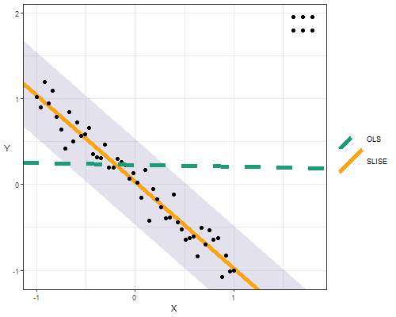

# SLISE - Sparse Linear Subset Explanations

R implementation of the SLISE algorithm. The SLISE algorithm can be used for
both robust regression and to explain outcomes from black box models.
For more details see [the paper](https://rdcu.be/bVbda), alternatively for a more informal
overview see [the presentation](vignettes/presentation.pdf), or [the poster](vignettes/poster.pdf).

> **Björklund A., Henelius A., Oikarinen E., Kallonen K., Puolamäki K.**  
> *Sparse Robust Regression for Explaining Classifiers.*  
> Discovery Science (DS 2019).  
> Lecture Notes in Computer Science, vol 11828, Springer.  
> https://doi.org/10.1007/978-3-030-33778-0_27


## Other Languages

The official Python version can be found [here](https://github.com/edahelsinki/pyslise).


## Installation

First install the `devtools`-package:

```R
install.packages("devtools")
```

Then install the `slise` package:

```R
devtools::install_github("edahelsinki/slise")
```

After installation, load the package using:

```R
library(slise)
```


## Example

In order to use SLISE you need to have your data in a numerical matrix (or
something that can be cast to a matrix), and the response as a numerical vector.
Below is an example of SLISE being used for robust regression:

```{R}
library(ggplot2)
source("experiments/regression/utils.R")
set.seed(42)

x <- seq(-1, 1, length.out = 50)
y <- -x + rnorm(50, 0, 0.15)
x <- c(x, rep(seq(1.6, 1.8, 0.1), 2))
y <- c(y, rep(c(1.8, 1.95), each = 3))

ols <- lm(y ~ x)$coefficients
slise <- slise.fit(x, y, epsilon = 0.5)

plot(slise, title = "", partial = TRUE, size = 2) +
    geom_abline(aes(intercept = ols[1], slope = ols[2], color = "OLS", linetype = "OLS"), size = 2) +
    scale_color_manual(values = c("#1b9e77", SLISE_ORANGE), name = NULL) +
    scale_linetype_manual(values = 2:1, name = NULL) +
    theme(axis.title.y = element_text(angle = 0, vjust = 0.5), legend.key.size = grid::unit(2, "line")) +
    guides(shape = FALSE, color = "legend", linetype = "legend")
```



SLISE can also be used to explain predictions from black box models such as convolutional neural networks:

```{R}
devtools::load_all()
source("experiments/regression/data.R")
set.seed(42)

emnist <- data_emnist(10000, digit=2, th = -1)
slise <- slise.explain(emnist$X, emnist$Y, 0.5, emnist$X[17,], emnist$Y[17], 3, 6)

plot(slise, "image", "", c("not 2", "is 2"), plots = 1)
```


## Dependencies

SLISE depends on the following R-packages:

 - Rcpp
 - RcppArmadillo
 - lbfgs

The following R-packages are optional, but needed for *some* of the built-in visualisations:

 - ggplot2
 - grid
 - gridExtra
 - reshape2
 - crayon
 - wordcloud
